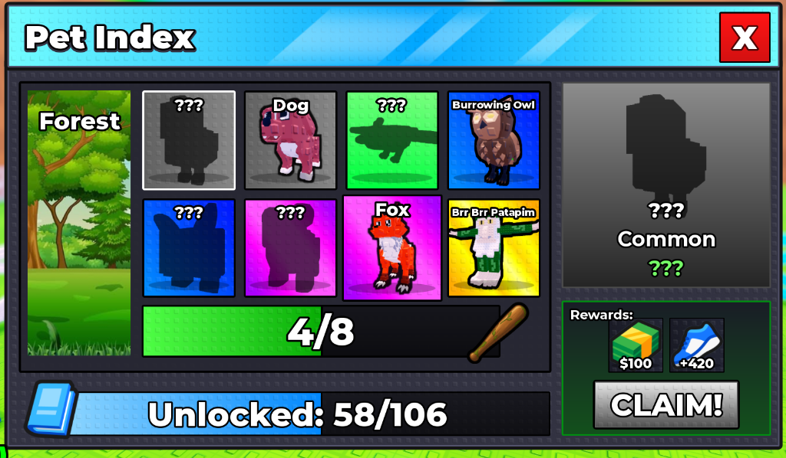

# 🥚 Steal An Egg — Roblox Developer & Art Portfolio

A vibrant, playful portfolio website designed for Roblox Game Developers, Luau Scripters, and 3D Voxel/Stud Artists. Inspired by classic Roblox stud graphics, retro Lego brick aesthetics, and viral arcade mechanics like **"Steal a Brainrot" / "Steal an Egg"**.



## 🚀 Live Demo & Repository
- **GitHub Repository**: [https://github.com/zhongthi-wq/stealanegg_portfolio](https://github.com/zhongthi-wq/stealanegg_portfolio)
- **Deployment Ready**: Optimized for 1-click deployment on [Vercel](https://vercel.com).

---

## ✨ Features

- **🧱 Classic Roblox Stud Texture**: Custom-crafted repeating stud patterns and beveled frames for an authentic Lego/Roblox brick vibe.
- **🎨 Vibrant & Cartoon Aesthetic**: High-energy neon accents (Electric Cyan, Hot Magenta, Acid Lime, Golden Sun), thick cartoon strokes, and tactile 3D buttons that physically press down when clicked.
- **🎒 In-Game "Pet / Project Index"**:
  - Interactive item vault inspired by Roblox pet collection indexes.
  - Rarity frames (*Common, Rare, Epic, Legendary, Brainrot Godly*).
  - Search & filter by categories (*Brainrot, Games, 3D Assets, UI Systems, Core Luau*).
  - Unlocked progress bar and rewarding sound effects.
  - Interactive Inspector Modal with detailed roles, technical stack, and playable Roblox links.
- **🛒 Commission Shop (Robux & Fiat)**:
  - In-game Gamepass-styled pricing tiers.
  - Clear Terms of Service (ToS) policy.
- **💬 1-Click Discord Copy & Socials**:
  - Instant clipboard copy with celebratory confetti and sound effects.
  - Quick links to Roblox Profile, Talent Hub, GitHub, and Twitter.
- **🔊 Web Audio SFX**: Built-in 8-bit arcade pop, chime, and claim sound synthesizers (no external sound files required).
- **⚡ Blazing Fast**: Built with React 18, Vite, and Tailwind CSS.

---

## 🛠️ How to Customize Your Info

All profile data, projects, commission rates, and links are neatly organized in a single file:
👉 **[`src/data/portfolioData.js`](src/data/portfolioData.js)**

To change:
- **Your Name & Bio**: Update `devProfile` (name, tagline, stats, avatar, level).
- **Your Projects & Screenshots**: Add or modify entries in `projects` array. To add new images, place them inside `public/assets/` and reference their path (e.g. `image: '/assets/my-game.png'`).
- **Your Discord & Links**: Update `socials.discordUsername` and URLs.
- **Pricing & Packages**: Edit `commissions.packages` and `commissions.termsOfService`.

---

## 💻 Local Development

```bash
# Clone the repository
git clone https://github.com/zhongthi-wq/stealanegg_portfolio.git

# Navigate to project folder
cd stealanegg_portfolio

# Install dependencies
npm install

# Run local dev server
npm run dev

# Build for production
npm run build
```

---

## 🌐 Deploy to Vercel (1-Click)

1. Go to [vercel.com](https://vercel.com) and log in with your GitHub account (`zhongthi-wq`).
2. Click **"Add New..."** ➜ **"Project"**.
3. Select the repository **`zhongthi-wq/stealanegg_portfolio`** and click **Import**.
4. Vercel automatically detects **Vite**:
   - **Framework Preset**: `Vite`
   - **Build Command**: `npm run build`
   - **Output Directory**: `dist`
5. Click **Deploy**! In ~30 seconds, your portfolio is live with a free `.vercel.app` domain and automatic SSL certificate. Any future `git push` to `main` will automatically re-deploy your site.

---

© Steal An Egg. Built with React, Vite & Tailwind CSS. Not affiliated with Roblox Corporation.
